# Retail Banking Database System

A normalized Oracle SQL database that models core retail banking operations — customers, accounts, and transactions — with enforced data integrity, reusable views, and analytical reporting queries.

## Problem Statement

Retail banks manage thousands of customers, multiple accounts per customer, and constant transaction activity (deposits, withdrawals, transfers). Without a well-structured database, this leads to inconsistent data, invalid balances, duplicate records, and no reliable way to audit money movement.

This project designs a relational database that:
- Enforces data integrity through constraints (no negative balances, no invalid account/transaction types)
- Tracks every transaction with full traceability (source account, destination account, timestamp)
- Supports analytical queries for business decisions (top customers, monthly trends, dormant accounts, fraud checks)

## Tech Stack

- **Database:** Oracle SQL
- **Tools:** Oracle SQL Developer / VS Code (SQL extension)
- **Concepts used:** Normalization, Primary/Foreign Keys, CHECK constraints, JOINs, Subqueries, Aggregation, Views, Window Functions

## Entity Relationship Diagram

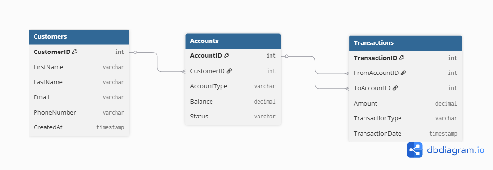

- **Customers → Accounts**: one customer can hold many accounts
- **Accounts → Transactions**: an account can appear in many transactions, either as the sender (`FromAccountID`) or receiver (`ToAccountID`)

## Database Schema

**Customers** — CustomerID (PK), FirstName, LastName, Email, PhoneNumber, CreatedAt

**Accounts** — AccountID (PK), CustomerID (FK), AccountType (Savings/Current), Balance, Status (Active/Frozen/Closed)

**Transactions** — TransactionID (PK), FromAccountID (FK), ToAccountID (FK), Amount, TransactionType (Deposit/Withdrawal/Transfer), TransactionDate

Key design choices:
- `Balance >= 0` and valid `AccountType`/`Status`/`TransactionType` values are enforced at the database level via `CHECK` constraints, not just application logic.
- A single Transactions table represents all three transaction types using NULL logic: `FromAccountID = NULL` → deposit, `ToAccountID = NULL` → withdrawal, both filled → transfer.

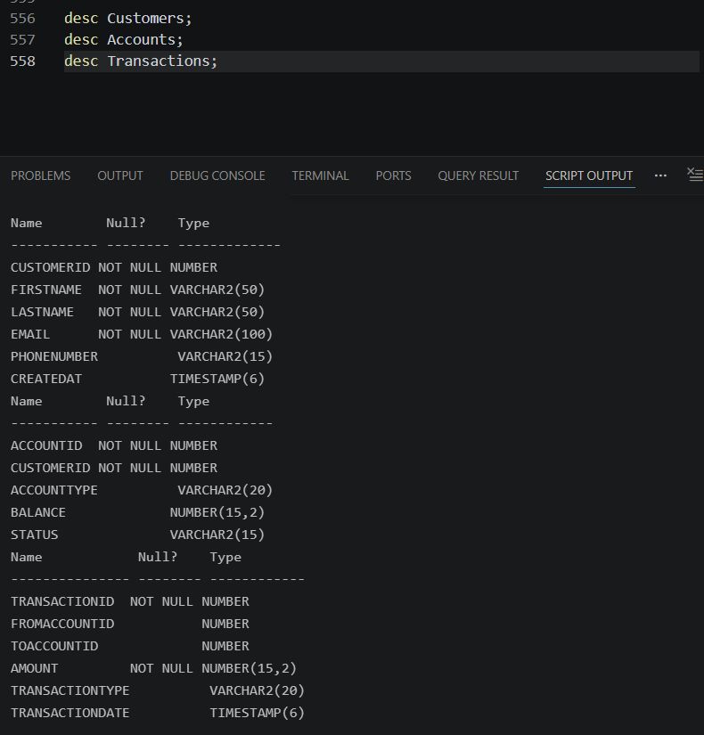

## Dataset

| Table | Row Count |
|---|---|
| Customers | 150 |
| Accounts | 200 |
| Transactions | 751 (spread across 12 months) |

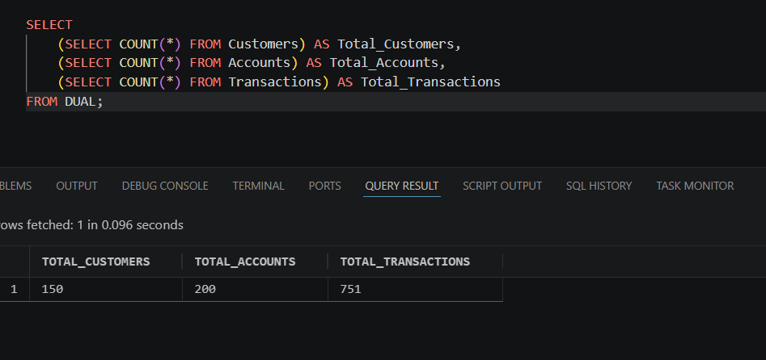

## Views

**`customer_account_summary`** — total accounts and total balance per customer.
```sql
SELECT * FROM customer_account_summary ORDER BY Total_Balance DESC;
```
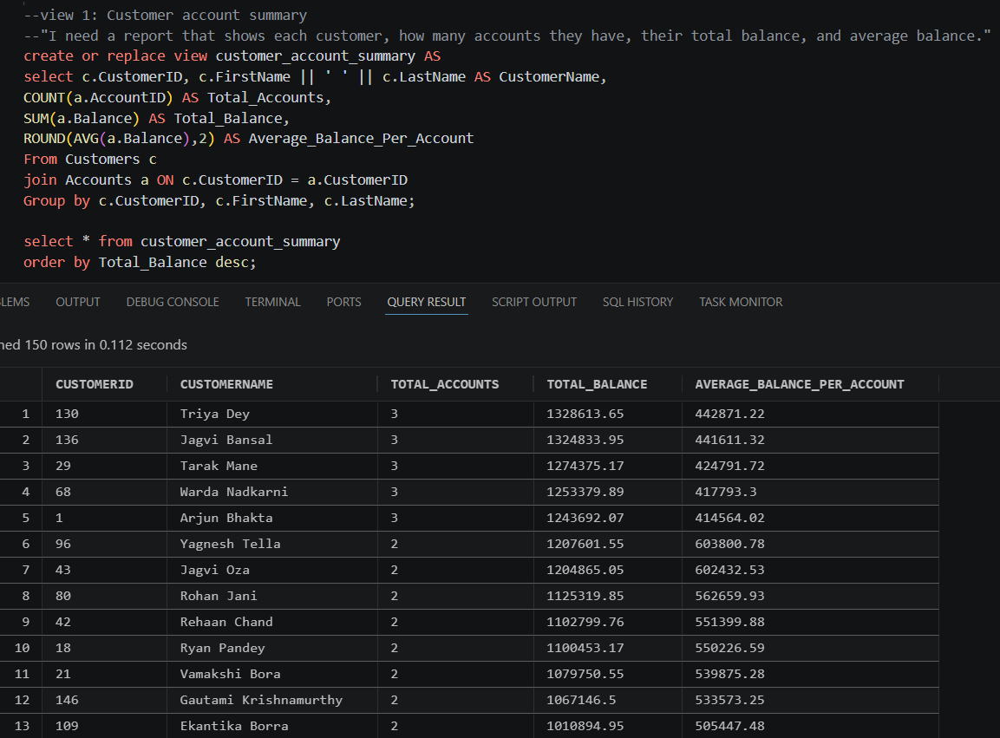

**`monthly_transaction_report`** — transaction count and volume, grouped by month and type.
```sql
SELECT * FROM monthly_transaction_report ORDER BY Transaction_Month DESC;
```
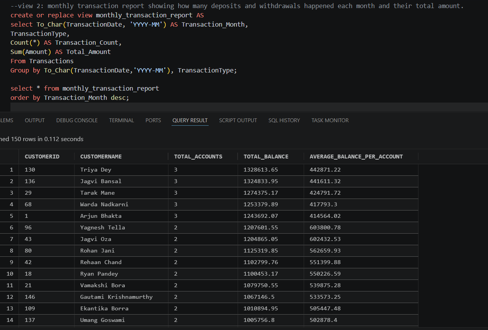

## Analytical Queries

| # | Question Answered | Screenshot |
|---|---|---|
| 1 | Top 5 customers by total balance | 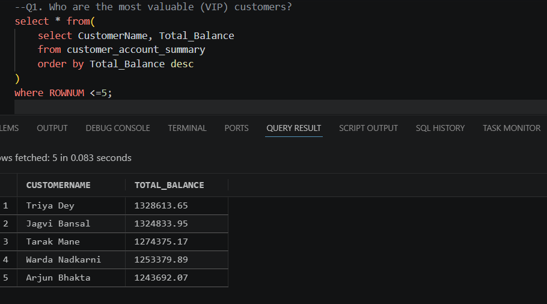 |
| 2 | Customers holding more than one account | 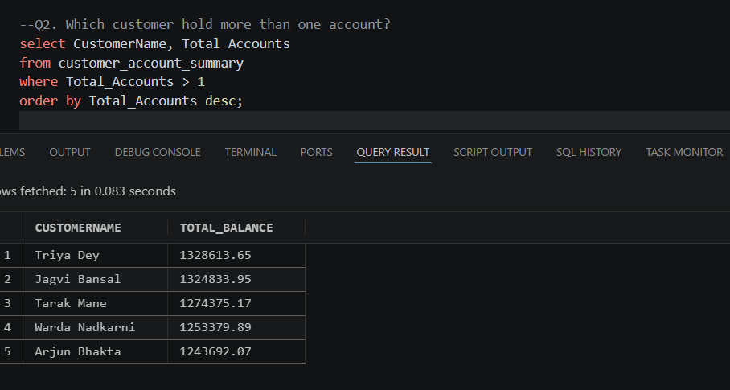 |
| 3 | Accounts below minimum balance (₹1000) | 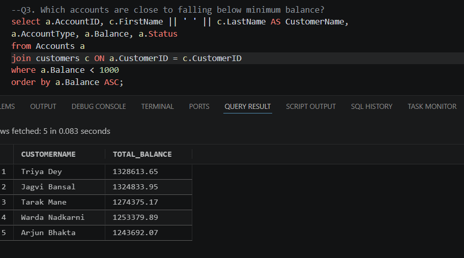 |
| 4 | Total deposits vs withdrawals vs transfers | 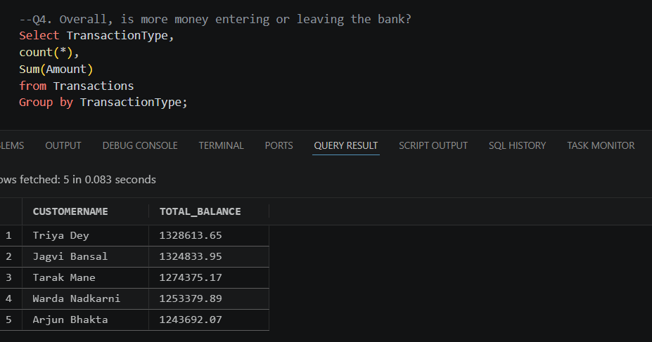 |
| 5 | Frozen or closed accounts (compliance check) | 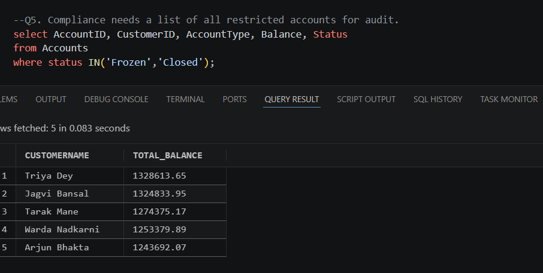 |
| 6 | Top 5 largest single transactions | 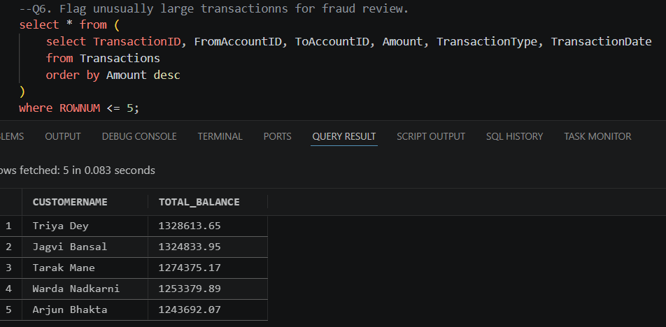 |
| 7 | Dormant accounts (no transaction history) | 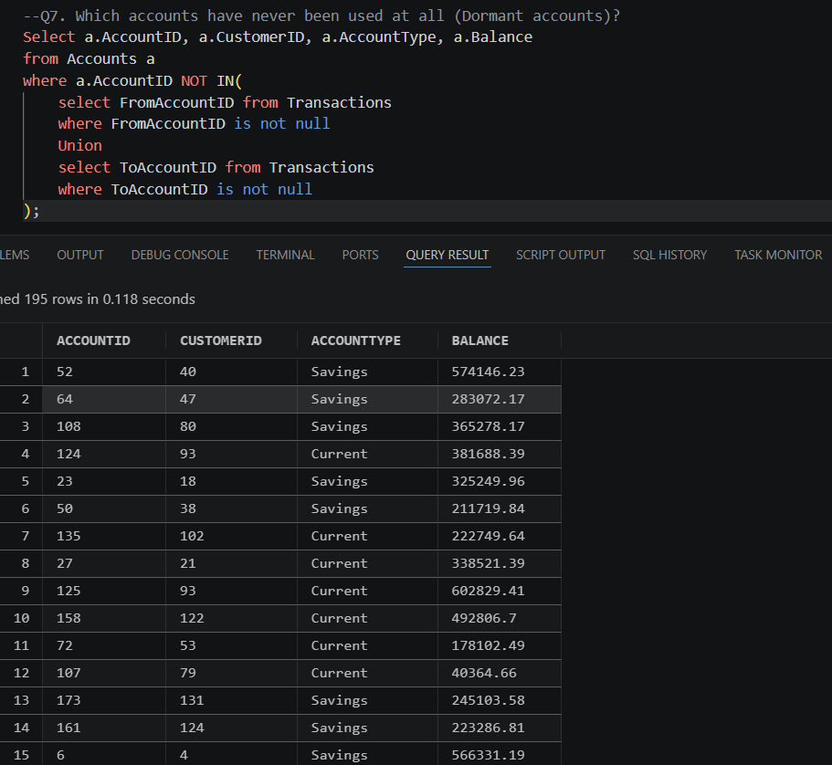 |
| 8 | Most active customer by transaction count | 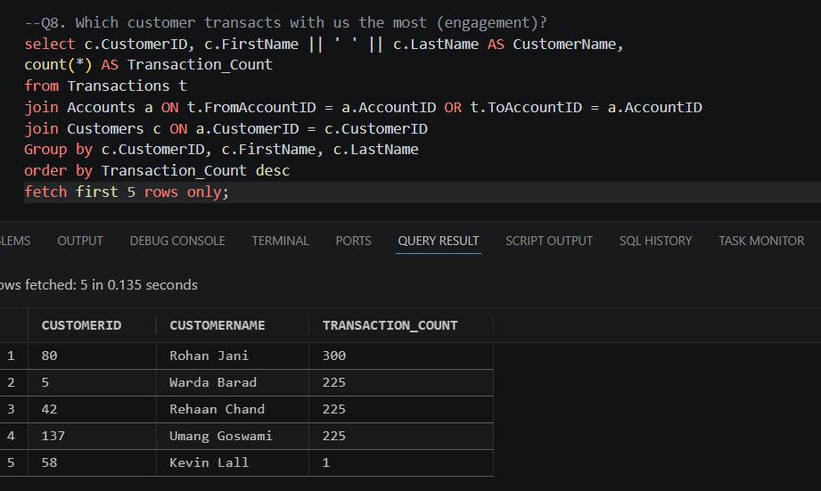 |
| 9 | Running total of deposits over time (window function) | 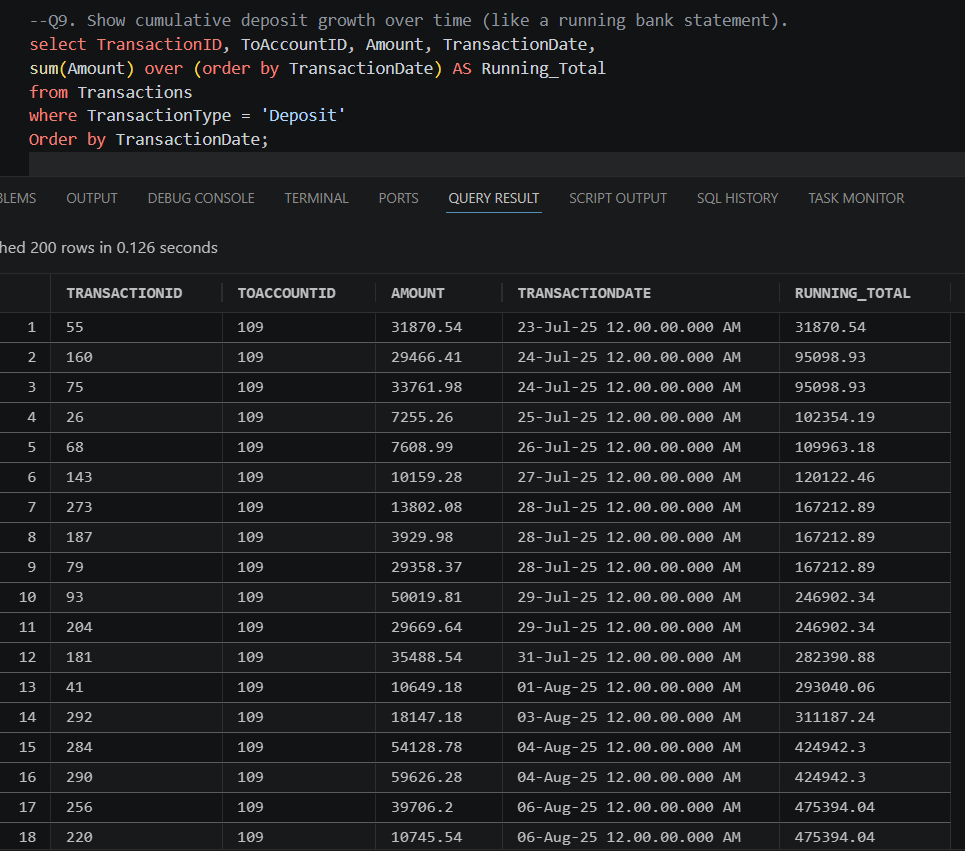 |
| 10 | Rank accounts by balance within each account type (window function) | 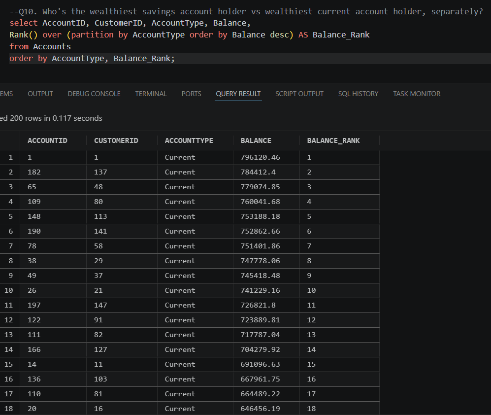 |

Full queries: [`4_analytical_queries_10.sql`](./4_analytical_queries_10.sql)

## Project Files

```
├── 1_schema.sql                    -- Table creation with constraints
├── 2_bulk_data.sql                 -- Sample data (customers, accounts, transactions)
├── 3_views_only.sql                -- 2 reusable views
├── 4_analytical_queries_10.sql     -- 10 analytical queries
├── 5_er_diagram.png                -- Entity relationship diagram
├── README.md
└── Screenshots/                    -- Query and view output screenshots
```

## What This Project Demonstrates

- Designing a normalized, real-world relational schema from a business problem
- Enforcing data integrity through constraints, not just application code
- Writing JOINs, subqueries, aggregations, and window functions
- Translating business questions ("who are our VIP customers?") into working SQL
- Debugging real data integrity issues (foreign key violations from identity sequence gaps)

## Author

*[Your name]* — MS in Information Technology, aspiring SQL Developer
